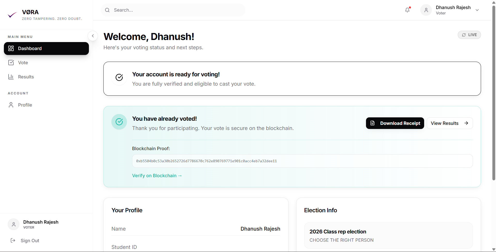
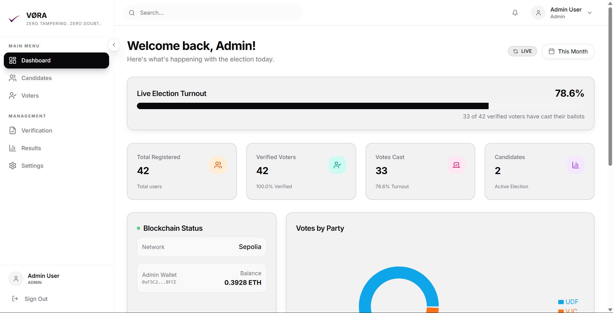
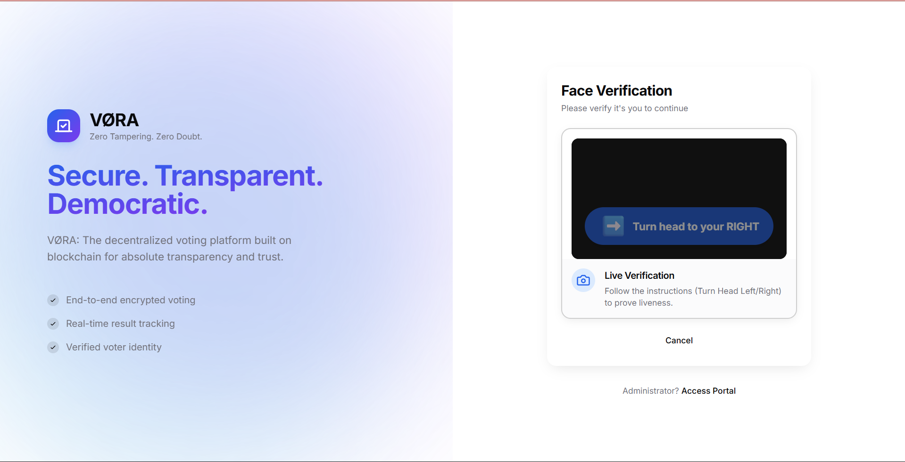

# 🗳️ VORA: The Future of Voting (No Pens, No Paper, No Lies)


> **VORA (Voting On-chain with Real-time Authentication)** is where the performance of a Web2 MERN stack meets the "trust-no-one" security of the Ethereum Blockchain. We’ve replaced rusty ballot boxes with AI-powered face recognition and unhackable smart contracts. It's safe, it's fast, and it finally makes voting feel like it belongs in the 21st century.

---

## 🌟 Why VORA? (Because the 1900s called, and they want their voting system back)

- **Stop the Drama**: No more "missing ballots" or "counting errors." The blockchain doesn't have a political agenda.
- **Passwords? Forget 'em**: Your face is your key. Unless you've mastered the art of identity theft via high-res photos (spoiler: our Liveness Detection says "Nice try"), your vote is yours and yours alone.
- **Vote from your Couch**: Desktop? Android? We’ve got you covered. Democracy should be as easy as ordering a pizza.

---

## 🛠️ Key Features

### 🔐 Passwords? So 2010 (AI Biometrics)
- **Liveness Detection**: Our AI tracks your head tilts. It knows the difference between a real human and a 4K photo of a human.
- **Biometric Matching**: Zero-password login. Just look at the screen and you're in (Confidence threshold: 0.45).
- **One-Person-One-Vote**: We ensure unique identity so you can't vote for your cat, your imaginary friend, or yourself twice.

### ⛓️ The Blockchain Never Forgets (Hybrid Storage)
- **MongoDB (The Flash)**: Lightning-fast profile management and candidate retrieval.
- **Ethereum Sepolia (The Vault)**: A permanent, tamper-proof record of every single vote. Once it's on-chain, not even the admin can "accidentally" delete it.

### 🚀 Better Voter Experience
- **Gas Fees? Our Treat**: We handle the technical blockchain fees via a server-side relay. You just click, and we pay the bill.
- **Real-time Tallies**: Watch the results roll in live. No more waiting 3 days for a spreadsheet.
- **Advanced Election Management**: Start new elections, archive the old ones, and browse history like a pro.
- **Always Informed**: A notification system that actually works—get updates for every major election milestone.
- **Capacitor Ready**: Optimized for the web and ready to deploy on Android devices.

---

## 📸 Project Showcase

> [!TIP]
> This section will be updated with high-resolution screenshots of your project once provided.

| Landing Page | Voter Dashboard |
| :---: | :---: |
|  |  |

| Admin Control Center | Face ID Verification |
| :---: | :---: |
|  |  |

---

## 🛠️ Technical Stack (The Wizardry)

| Category | Technology | The "Vibe" |
| :--- | :--- | :--- |
| **Frontend** | React 18, TS, Vite | Speed of light development ⚡ |
| **Styling** | Tailwind CSS, Shadcn | Making "looking good" effortless ✨ |
| **Backend** | Node.js, Express | The reliable engine room 🚀 |
| **Database** | MongoDB Atlas | Fast, flexible, and scalable 🍃 |
| **Blockchain** | Solidity, Ethers.js | Because trust should be automated ⛓️ |
| **Network** | Ethereum Sepolia | The testnet where dreams come true 🌐 |
| **Biometrics** | Face-api.js | Artificial Intelligence with an actual eye 👁️ |

---

## 📂 Project Structure

```text
├── android/               # Capacitor Android project
├── server/                # Backend (Express & Node.js)
│   ├── src/
│   │   ├── config/        # Database & Blockchain configs
│   │   ├── controllers/   # Request handlers (Auth, Vote, Admin)
│   │   ├── models/        # Mongoose Schemas (User, Candidate, Election)
│   │   └── routes/        # API Endpoints
├── smart-contracts/       # Web3 Layer (Solidity & Hardhat)
│   ├── contracts/         # Election.sol
│   └── scripts/           # Deployment & Verification scripts
├── src/                   # Frontend (React & Vite)
│   ├── components/        # Reusable Shadcn UI components
│   ├── hooks/             # Custom React hooks (Auth, Mobile)
│   └── pages/             # Main Views (Voter, Admin, Results)
└── public/                # Static assets (Models, Images)
```

---

## ⚙️ Architecture & Workflow

### 1. Enrollment & Registration
User registration requires a liveness test:
1. **Pose Challenge**: The UI asks the user to tilt their head (Left/Right) randomly.
2. **Analysis**: The `face-api.js` model tracks landmarks in real-time.
3. **Capture**: Once verified live, 3 reference snapshots are captured, hashed, and stored in MongoDB.

### 2. Candidate Lifecycle (Admin)
Admin creates a candidate in the dashboard. Two simultaneous operations occur:
- **Off-Chain**: A record is saved in MongoDB for instant frontend display.
- **On-Chain**: A `contract.addCandidate(mongoId, name)` transaction is sent to the Sepolia network. The MongoDB ID serves as the unique identifier on the blockchain.

### 3. The Voting Relay (Web3)
To eliminate UX friction (MetaMask popups/gas costs for students), VORA uses a **Server-Side Relay**:
1. **Auth**: Voter logs in via Face ID.
2. **Eligibility**: Server checks `isFaceVerified` and `hasVoted` in MongoDB.
3. **Relay**: The server's master wallet (configured via `PRIVATE_KEY`) triggers the `contract.vote(candidateId)` function.
4. **Receipt**: The resulting `transactionHash` is saved to the user's voting record in MongoDB for future verification.

---

## 📡 API Reference (Partial)

### Authentication & Profile
- `POST /api/auth/register`: Create new user profile.
- `POST /api/auth/login`: Face-based biometric login.
- `GET /api/auth/profile`: Fetch current user data and voting history.
- `PUT /api/auth/update-password`: Change user password.
- `PUT /api/auth/update-face`: Refresh stored biometric embeddings.

### Biometric & Uploads
- `POST /api/face/verify-face`: Run AI comparison on current snapshot.
- `POST /api/face/register-embedding`: Store face ID templates.
- `POST /api/uploads`: Securely upload face reference images.

### Voting & Elections
- `POST /api/vote`: Secure relay to cast a vote on-chain.
- `GET /api/vote/verify/:hash`: Check transaction status on the Sepolia network.
- `GET /api/election`: Fetch current active election configuration.
- `GET /api/election/results`: View public real-time tallies.

### Notifications
- `GET /api/auth/notifications`: Fetch user-specific notifications.
- `PUT /api/auth/notifications/:id/read`: Mark a single notification as read.
- `PUT /api/auth/notifications/read-all`: Mark all as read.

### Admin Dashboard (Protected)
- `GET /api/admin/dashboard`: Global stats (Voter turnout, reg status).
- `GET /api/admin/results`: Detailed per-candidate breakdown.
- `GET /api/admin/results/publish`: Toggle visibility of final results.
- `POST /api/admin/election/new`: Start a fresh election session.
- `POST /api/admin/election/stop`: Emergency election pause.
- `GET /api/admin/elections`: Browse historical election data.
- `GET /api/admin/voters`: Manage registered users and manual verifications.

---

## 🚀 Installation & Setup

### 1. Environment Variables
Create a `.env` in the `/server` directory:
```env
PORT=5000
MONGO_URI=your_mongodb_cluster_url
JWT_SECRET=your_jwt_signing_key
SEPOLIA_RPC_URL=alchemy_or_infura_url
PRIVATE_KEY=your_master_wallet_private_key
CONTRACT_ADDRESS=deployed_contract_on_sepolia
```

### 2. Smart Contract Deployment
```bash
cd smart-contracts
npm install
npx hardhat compile
npx hardhat run scripts/deploy.ts --network sepolia
```

### 3. Application Launch
```bash
# Terminal 1: Backend
cd server && npm install && npm run dev

# Terminal 2: Frontend
npm install && npm run dev
```

---

## 🛡️ Security Measures
- **Rate Limiting**: Prevents brute-force on API endpoints.
- **JWT Protection**: All sensitive routes are guarded by secure middleware.
- **Blockchain Immortality**: Once a vote is cast, it cannot be deleted or altered by any database admin.
- **Liveness Guard**: Prevents identity theft via high-resolution photos of registered users.

---

## 📜 License & Credits

Developed by **Dhanush Rajesh**. Built for the future of secure, accessible, and transparent digital democracy.

---
*VORA | Secure. Transparent. Decentralized.*
